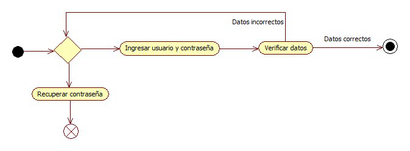

# Login

### Diagrama de Actividadess

En la pantalla de login el usuario deberá ingresar su ususario y contraseña. Si algún dato esta erroneo, manda un error y se le dice al usuario que intente ingresar sus datos de nuevo. Si los datos estan correctos ingresa a la página de inicio. El usuario también tiene la opción de recuperar su contraseña en caso de que no la recuerde.